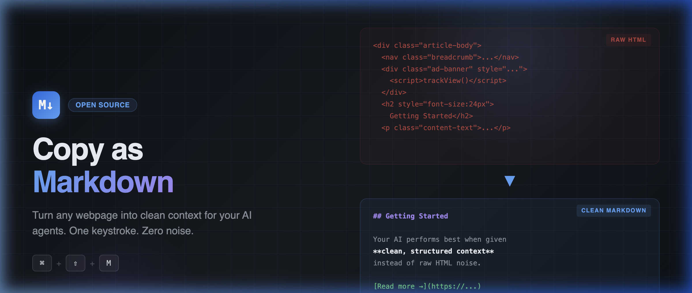

<p align="center">
  
</p>

<p align="center">
  <strong>Turn any webpage into clean Markdown. One keystroke.</strong>
</p>

<p align="center">
  <a href="#install"></a>
  <a href="#install"></a>
  <a href="#install"></a>
  <a href="#install"></a>
  <a href="LICENSE"></a>
  <a href="#privacy"></a>
</p>

---

## The Problem

When you paste web content into ChatGPT, Claude, Copilot, or any AI tool, you're not pasting content. You're pasting **noise**:

```html
<div class="article-body" data-tracker="abc123">
  <nav class="breadcrumb">Home > Blog > AI</nav>
  <div class="ad-banner" style="display:flex;padding:20px">
    <script>trackPageView('article-123')</script>
  </div>
  <h2 style="font-size:24px;color:#333;margin-top:20px">Getting Started</h2>
  <p class="content-text" id="p1">Your AI performs best when given
  <strong>clean, structured context</strong>...</p>
</div>
```

That noise eats tokens, wastes money, and confuses your model. What your AI actually needs:

```markdown
## Getting Started

Your AI performs best when given **clean, structured context**...
```

**Copy as Markdown strips the noise and gives your AI pure signal.**

---

## How It Works

**Select → Copy → Paste.** That's it.

1. **Select** any content on any webpage (or copy the full page — no selection needed)
2. Press `Cmd+Shift+M` (or right-click → **Copy as Markdown**)
3. **Paste** directly into ChatGPT, Claude, Copilot, your terminal, your notes — anywhere

No popups. No settings. No account. No internet connection. Works offline, instantly.

---

## Why Context Management Matters

Every AI tool — whether it's a chatbot, a coding agent, or an automation pipeline — runs on **context**. The better the context you feed it, the better it performs.

The problem is that context lives everywhere: web pages, documentation, articles, internal wikis, SharePoint, Confluence, Notion. When you need to move knowledge from one source to another — from a browser to your AI, from one copilot session to the next — the format matters.

**Markdown is the universal format your AI understands.** It's what ChatGPT, Claude, Copilot, and every major AI tool reads natively. Clean structure, no noise, maximum signal per token.

Copy as Markdown gives you that conversion in one keystroke — anywhere, on any page.

**Use it to:**
- Feed research and documentation into ChatGPT, Claude, or Copilot
- Build AI agent pipelines that process web content cleanly
- Populate RAG systems and vector databases with structured source material
- Carry context between copilot sessions without losing formatting
- Save context window space when working with long documents

---

## Install

Takes 30 seconds. No app store required.

<a id="install"></a>

### Chrome, Edge, or Brave

1. [Download the ZIP](https://github.com/sulmatajb/copy-as-markdown/archive/refs/heads/main.zip) and unzip — or clone:
   ```bash
   git clone https://github.com/sulmatajb/copy-as-markdown.git
   ```
2. Open `chrome://extensions`
3. Enable **Developer mode** (toggle, top-right)
4. Click **Load unpacked** → select the `copy-as-markdown/` folder

Done. The extension is live.

### Firefox

1. Clone or download the repo
2. Open `about:debugging#/runtime/this-firefox`
3. Click **Load Temporary Add-on…** → select `manifest.json`

> Firefox temporary add-ons are removed on restart. Permanent install requires Mozilla signing.

---

## Usage

### Keyboard shortcut

| Platform | Shortcut |
| --- | --- |
| macOS | `Cmd` + `Shift` + `M` |
| Windows / Linux | `Ctrl` + `Shift` + `M` |

When text is selected, copies the selection. When nothing is selected, copies the **full page** (with automatic noise removal — nav, footer, ads, sidebars are stripped).

To remap: `chrome://extensions/shortcuts`

### Right-click menu

| Action | When |
| --- | --- |
| **Copy as Markdown** | Text selected |
| **Copy Full Page as Markdown** | Any page |
| **Save as Markdown file** | Any page — downloads a `.md` file |

---

## What Gets Converted

| HTML | → Markdown |
| --- | --- |
| `<h1>` – `<h6>` | `#` `##` `###` headings |
| `<strong>`, `<b>` | `**bold**` |
| `<em>`, `<i>` | `*italic*` |
| `<del>`, `<s>` | `~~strikethrough~~` |
| `<a href="...">` | `[text](url)` |
| `` | `` |
| `<ul>`, `<ol>` | Nested lists with proper indentation |
| `<table>` | Full GFM pipe table syntax |
| `<pre><code>` | Fenced code blocks with language detection |
| `<blockquote>` | `> blockquote` |
| `<p>` | Clean paragraphs |

---

## CLI — For AI Agents and Pipelines

A companion CLI fetches any URL and outputs clean Markdown to stdout. Built for piping into AI tools, scripts, and automation.

```bash
# No install required
npx copy-as-markdown https://example.com/article

# Save to file
npx copy-as-markdown https://example.com/article > article.md

# Pipe into an LLM
npx copy-as-markdown https://news.ycombinator.com/item?id=12345 | llm "summarize this"

# Include page title as H1
npx copy-as-markdown https://example.com/post --title
```

### CLI Options

| Flag | Description |
| --- | --- |
| `--title` | Prepend the page title as an H1 heading |
| `--no-readability` | Skip article extraction — convert the full page body |
| `--help` | Show usage |

### Install globally

```bash
npm install -g copy-as-markdown
```

---

<a id="privacy"></a>

## Privacy

- **Zero network requests** — nothing leaves your machine
- **No telemetry** — no analytics, no tracking, no logging
- **No account** — no sign-in, no email, no onboarding
- **Open source** — read every line of code yourself

---

## Tech Stack

- **Manifest V3** — Chrome, Edge, Brave, Firefox 109+
- **Vanilla JavaScript** — no frameworks, no build step, no dependencies
- **[Turndown.js](https://github.com/mixmark-io/turndown)** (MIT) — bundled locally, no CDN
- **[@mozilla/readability](https://github.com/mozilla/readability)** — CLI article extraction

---

## Contributing

Contributions welcome. 

1. Fork the repo
2. Create a branch: `git checkout -b feature/your-change`
3. Commit with a clear message
4. Push and open a pull request

**Good first issues:**
- Turndown plugin for `<figure>` / `<figcaption>` handling
- Support `<details>` / `<summary>` conversion
- Firefox permanent install packaging
- Unit tests for conversion rules

---

## License

MIT — use it, fork it, ship it.

---

<p align="center">
  <strong>Your AI is only as good as the context you give it.</strong><br>
  Give it Markdown.
</p>
